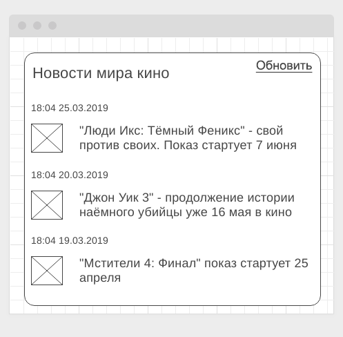

#### Deployment: <a href="">Github Pages</a>
#### Backend: <a href="https://github.com/Sergius92739/ahj-12.3-workers_buggy_service_b">Repository</a>
#### Server: <a href="https://ahj-12-3-workers-buggy-service.herokuapp.com/">Heroku</a>

---

### Buggy Service

#### Легенда

Вам выпала нелёгкая задача - интегрироваться с "глючным" сторонним сервисом новостей. Сервер периодически "отваливается", отвечая кодом 500. Поскольку вы уже знакомы с Service Workers, вы решили кэшировать ответы сервера, когда они всё-таки появляются и отдавать закешированные, если сервер отвечает ошибкой.

#### Описание

Вам необходимо реализовать сервер, эмулирующий эту ситуацию (достаточно выставлять правильный код в koa, как мы это делали в лекции по HTTP, либо можете дополнительно ознакомиться с [обработкой ошибок в koa](https://github.com/koajs/koa/wiki/Error-Handling)).

Общий вид интерфейса:

Можете использовать сервер из предыдущего задания, добавив туда генерацию ошибки случайным образом.
